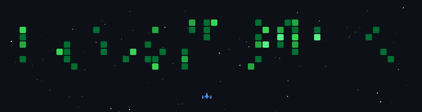

<h1 align="center">Hi 👋, I'm DZombies45</h1>

<h1 align="center">💫 About Me:</h1>

🌟 Someone trying to be a YouTuber and coder for minecraft bedrock🎥💻

<h2 align="center">🌐 Socials:<h2>

  

  <!--  -->
  
  
  
  

<h2 align="center">💻 Languages and Tools:<h2>

  

<h2 align="center">📊 GitHub Statistic:<h2>

     
     
    

<h2 align="center">🎬 Latest Blog Post<h2>

<table>
<!-- BLOG-POST-LIST:START --><tr><td><a href="https://dzombies45.github.io/posts/rewrite-shome-again/">Rewrite SHome again</a></td><td>&lt;h1 class=&quot;relative group&quot;&gt;rewrite the code again
 &lt;div id=&quot;rewrite-the-code-again&quot; class=&quot;anchor&quot;&gt;&lt;/div&gt;
 
 &lt;span
 class=&quot;absolute top-0 w-6 transition-opacity opacity-0 -start-6 not-prose group-hover:opacity-100 select-none&quot;&gt;
 &lt;a class=&quot;text-primary-300 dark:text-neutral-700 !no-underline&quot; href=&quot;#rewrite-the-code-again&quot; aria-label=&quot;Anchor&quot;&gt;#&lt;/a&gt;
 &lt;/span&gt;
 
&lt;/h1&gt;
&lt;p&gt;i want to make it easy for me to add new stuff, and its the 5th time i rewrite the whole code.
i keep forgetting what i code and how i do it, and then thare is that script v2 thing and custom command, so i just make thing up to patch it and the code is a mess&lpar;for me&rpar; because of it.
now i want to code it so that its eazy to fix and update.&lt;/p&gt; 6 Jan, 2026</td></tr><
<tr><td><a href="https://dzombies45.github.io/projects/day-night-tuner/">day night tuner</a></td><td>&lt;h1 class=&quot;relative group&quot;&gt;how it work
 &lt;div id=&quot;how-it-work&quot; class=&quot;anchor&quot;&gt;&lt;/div&gt;
 
 &lt;span
 class=&quot;absolute top-0 w-6 transition-opacity opacity-0 -start-6 not-prose group-hover:opacity-100 select-none&quot;&gt;
 &lt;a class=&quot;text-primary-300 dark:text-neutral-700 !no-underline&quot; href=&quot;#how-it-work&quot; aria-label=&quot;Anchor&quot;&gt;#&lt;/a&gt;
 &lt;/span&gt;
 
&lt;/h1&gt;
&lt;p&gt;it chenga the time it need to finish 1 cycle of day or night
for example: if you set the day to 20 minute, a full day night cycle will be 30 minute, couse by default day and night is 10 minute each so 20 per cycle&lt;/p&gt;
&lt;p&gt;&lt;strong&gt;&lpar;it still in progres&rpar;&lt;/strong&gt;&lt;/p&gt; 3 Jul, 2025</td></tr><
<tr><td><a href="https://dzombies45.github.io/projects/custom-command/">Custom Command</a></td><td>&lt;h3 class=&quot;relative group&quot;&gt;how to use
 &lt;div id=&quot;how-to-use&quot; class=&quot;anchor&quot;&gt;&lt;/div&gt;
 
 &lt;span
 class=&quot;absolute top-0 w-6 transition-opacity opacity-0 -start-6 not-prose group-hover:opacity-100 select-none&quot;&gt;
 &lt;a class=&quot;text-primary-300 dark:text-neutral-700 !no-underline&quot; href=&quot;#how-to-use&quot; aria-label=&quot;Anchor&quot;&gt;#&lt;/a&gt;
 &lt;/span&gt;
 
&lt;/h3&gt;
&lt;p&gt;go to my github repo &lt;a href=&quot;https://github.com/DZombies45/MCBE-CustomCommand&quot; target=&quot;_blank&quot; rel=&quot;noreferrer&quot;&gt;here&lt;/a&gt; and see its page, or use &lt;a href=&quot;https://dzombies45.github.io/MCBE-CustomCommand/&quot; target=&quot;_blank&quot; rel=&quot;noreferrer&quot;&gt;this link&lt;/a&gt; for the wiki page.&lt;/p&gt;
&lt;p&gt;this use minecraft&amp;rsquo;s own api &lt;a href=&quot;https://learn.microsoft.com/id-id/minecraft/creator/scriptapi/minecraft/server/customcommandregistry?view=minecraft-bedrock-experimental&amp;amp;viewFallbackFrom=minecraft-bedrock-stable&quot; target=&quot;_blank&quot; rel=&quot;noreferrer&quot;&gt;CustomCommandRegistry&lt;/a&gt; for custom command&lt;/p&gt;
&lt;p&gt;it make the making of custom command easyer to read and understand &lpar;thats what i hope&rpar;&lt;/p&gt;
&lt;div class=&quot;github-card-wrapper&quot;&gt;
 &lt;a id=&quot;github-a7a185fc106a4ca48a56a17bc679c469&quot; target=&quot;_blank&quot; href=&quot;https://github.com/DZombies45/MCBE-CustomCommand&quot; class=&quot;cursor-pointer&quot;&gt;
 &lt;div
 class=&quot;w-full md:w-auto p-0 m-0 border border-neutral-200 dark:border-neutral-700 border rounded-md shadow-2xl&quot;&gt;&lt;div class=&quot;w-full nozoom&quot;&gt;
 &lt;img
 src=&quot;https://opengraph.githubassets.com/0/DZombies45/MCBE-CustomCommand&quot;
 alt=&quot;GitHub Repository Thumbnail&quot;
 class=&quot;nozoom mt-0 mb-0 w-full h-full object-cover&quot;&gt;
 &lt;/div&gt;&lt;div class=&quot;w-full md:w-auto pt-3 p-5&quot;&gt;
 &lt;div class=&quot;flex items-center&quot;&gt;
 &lt;span class=&quot;text-2xl text-neutral-800 dark:text-neutral me-2&quot;&gt;
 &lt;span class=&quot;relative block icon&quot;&gt;&lt;svg xmlns=&quot;http://www.w3.org/2000/svg&quot; viewBox=&quot;0 0 496 512&quot;&gt;&lt;path fill=&quot;currentColor&quot; d=&quot;M165.9 397.4c0 2-2.3 3.6-5.2 3.6-3.3.3-5.6-1.3-5.6-3.6 0-2 2.3-3.6 5.2-3.6 3-.3 5.6 1.3 5.6 3.6zm-31.1-4.5c-.7 2 1.3 4.3 4.3 4.9 2.6 1 5.6 0 6.2-2s-1.3-4.3-4.3-5.2c-2.6-.7-5.5.3-6.2 2.3zm44.2-1.7c-2.9.7-4.9 2.6-4.6 4.9.3 2 2.9 3.3 5.9 2.6 2.9-.7 4.9-2.6 4.6-4.6-.3-1.9-3-3.2-5.9-2.9zM244.8 8C106.1 8 0 113.3 0 252c0 110.9 69.8 205.8 169.5 239.2 12.8 2.3 17.3-5.6 17.3-12.1 0-6.2-.3-40.4-.3-61.4 0 0-70 15-84.7-29.8 0 0-11.4-29.1-27.8-36.6 0 0-22.9-15.7 1.6-15.4 0 0 24.9 2 38.6 25.8 21.9 38.6 58.6 27.5 72.9 20.9 2.3-16 8.8-27.1 16-33.7-55.9-6.2-112.3-14.3-112.3-110.5 0-27.5 7.6-41.3 23.6-58.9-2.6-6.5-11.1-33.3 2.6-67.9 20.9-6.5 69 27 69 27 20-5.6 41.5-8.5 62.8-8.5s42.8 2.9 62.8 8.5c0 0 48.1-33.6 69-27 13.7 34.7 5.2 61.4 2.6 67.9 16 17.7 25.8 31.5 25.8 58.9 0 96.5-58.9 104.2-114.8 110.5 9.2 7.9 17 22.9 17 46.4 0 33.7-.3 75.4-.3 83.6 0 6.5 4.6 14.4 17.3 12.1C428.2 457.8 496 362.9 496 252 496 113.3 383.5 8 244.8 8zM97.2 352.9c-1.3 1-1 3.3.7 5.2 1.6 1.6 3.9 2.3 5.2 1 1.3-1 1-3.3-.7-5.2-1.6-1.6-3.9-2.3-5.2-1zm-10.8-8.1c-.7 1.3.3 2.9 2.3 3.9 1.6 1 3.6.7 4.3-.7.7-1.3-.3-2.9-2.3-3.9-2-.6-3.6-.3-4.3.7zm32.4 35.6c-1.6 1.3-1 4.3 1.3 6.2 2.3 2.3 5.2 2.6 6.5 1 1.3-1.3.7-4.3-1.3-6.2-2.2-2.3-5.2-2.6-6.5-1zm-11.4-14.7c-1.6 1-1.6 3.6 0 5.9 1.6 2.3 4.3 3.3 5.6 2.3 1.6-1.3 1.6-3.9 0-6.2-1.4-2.3-4-3.3-5.6-2z&quot;/&gt;&lt;/svg&gt;
&lt;/span&gt;
 &lt;/span&gt;
 &lt;div
 id=&quot;github-a7a185fc106a4ca48a56a17bc679c469-full_name&quot;
 class=&quot;m-0 font-bold text-xl text-neutral-800 decoration-primary-500 hover:underline hover:underline-offset-2 dark:text-neutral&quot;&gt;
 DZombies45/MCBE-CustomCommand
 &lt;/div&gt;
 &lt;/div&gt;

 &lt;p id=&quot;github-a7a185fc106a4ca48a56a17bc679c469-description&quot; class=&quot;m-0 mt-2 text-md text-neutral-800 dark:text-neutral&quot;&gt;
 Custom Command for Minecraft Bedrock
 &lt;/p&gt; 5 May, 2025</td></tr><
<tr><td><a href="https://dzombies45.github.io/projects/mcbe-signal-system/">mcbe signal system</a></td><td>&lt;h1 class=&quot;relative group&quot;&gt;using scriptEvent to call and listen other addon like an api
 &lt;div id=&quot;using-scriptevent-to-call-and-listen-other-addon-like-an-api&quot; class=&quot;anchor&quot;&gt;&lt;/div&gt;
 
 &lt;span
 class=&quot;absolute top-0 w-6 transition-opacity opacity-0 -start-6 not-prose group-hover:opacity-100 select-none&quot;&gt;
 &lt;a class=&quot;text-primary-300 dark:text-neutral-700 !no-underline&quot; href=&quot;#using-scriptevent-to-call-and-listen-other-addon-like-an-api&quot; aria-label=&quot;Anchor&quot;&gt;#&lt;/a&gt;
 &lt;/span&gt;
 
&lt;/h1&gt;
&lt;div class=&quot;highlight-wrapper&quot;&gt;&lt;div class=&quot;highlight&quot;&gt;&lt;pre tabindex=&quot;0&quot; class=&quot;chroma&quot;&gt;&lt;code class=&quot;language-js&quot; data-lang=&quot;js&quot;&gt;&lt;span class=&quot;line&quot;&gt;&lt;span class=&quot;cl&quot;&gt;&lt;span class=&quot;kr&quot;&gt;import&lt;/span&gt; &lt;span class=&quot;p&quot;&gt;{&lt;/span&gt; &lt;span class=&quot;nx&quot;&gt;ScriptEventSource&lt;/span&gt;&lt;span class=&quot;p&quot;&gt;,&lt;/span&gt; &lt;span class=&quot;nx&quot;&gt;system&lt;/span&gt; &lt;span class=&quot;p&quot;&gt;}&lt;/span&gt; &lt;span class=&quot;nx&quot;&gt;from&lt;/span&gt; &lt;span class=&quot;s2&quot;&gt;&amp;#34;@minecraft/server&amp;#34;&lt;/span&gt;&lt;span class=&quot;p&quot;&gt;;&lt;/span&gt;
&lt;/span&gt;&lt;/span&gt;&lt;span class=&quot;line&quot;&gt;&lt;span class=&quot;cl&quot;&gt;
&lt;/span&gt;&lt;/span&gt;&lt;span class=&quot;line&quot;&gt;&lt;span class=&quot;cl&quot;&gt;&lt;span class=&quot;c1&quot;&gt;// initial variable
&lt;/span&gt;&lt;/span&gt;&lt;/span&gt;&lt;span class=&quot;line&quot;&gt;&lt;span class=&quot;cl&quot;&gt;&lt;span class=&quot;kr&quot;&gt;const&lt;/span&gt; &lt;span class=&quot;nx&quot;&gt;namespace&lt;/span&gt; &lt;span class=&quot;o&quot;&gt;=&lt;/span&gt; &lt;span class=&quot;s2&quot;&gt;&amp;#34;dz&amp;#34;&lt;/span&gt;&lt;span class=&quot;p&quot;&gt;;&lt;/span&gt;
&lt;/span&gt;&lt;/span&gt;&lt;span class=&quot;line&quot;&gt;&lt;span class=&quot;cl&quot;&gt;&lt;span class=&quot;kr&quot;&gt;const&lt;/span&gt; &lt;span class=&quot;nx&quot;&gt;signalId&lt;/span&gt; &lt;span class=&quot;o&quot;&gt;=&lt;/span&gt; &lt;span class=&quot;sb&quot;&gt;`&lt;/span&gt;&lt;span class=&quot;si&quot;&gt;${&lt;/span&gt;&lt;span class=&quot;nx&quot;&gt;namespace&lt;/span&gt;&lt;span class=&quot;si&quot;&gt;}&lt;/span&gt;&lt;span class=&quot;sb&quot;&gt;:signal`&lt;/span&gt;&lt;span class=&quot;p&quot;&gt;;&lt;/span&gt;
&lt;/span&gt;&lt;/span&gt;&lt;span class=&quot;line&quot;&gt;&lt;span class=&quot;cl&quot;&gt;
&lt;/span&gt;&lt;/span&gt;&lt;span class=&quot;line&quot;&gt;&lt;span class=&quot;cl&quot;&gt;&lt;span class=&quot;c1&quot;&gt;// aignal list
&lt;/span&gt;&lt;/span&gt;&lt;/span&gt;&lt;span class=&quot;line&quot;&gt;&lt;span class=&quot;cl&quot;&gt;&lt;span class=&quot;kr&quot;&gt;const&lt;/span&gt; &lt;span class=&quot;nx&quot;&gt;requestPending&lt;/span&gt; &lt;span class=&quot;o&quot;&gt;=&lt;/span&gt; &lt;span class=&quot;k&quot;&gt;new&lt;/span&gt; &lt;span class=&quot;nx&quot;&gt;Map&lt;/span&gt;&lt;span class=&quot;p&quot;&gt;&lpar;&rpar;;&lt;/span&gt;
&lt;/span&gt;&lt;/span&gt;&lt;span class=&quot;line&quot;&gt;&lt;span class=&quot;cl&quot;&gt;&lt;span class=&quot;kr&quot;&gt;const&lt;/span&gt; &lt;span class=&quot;nx&quot;&gt;responseWith&lt;/span&gt; &lt;span class=&quot;o&quot;&gt;=&lt;/span&gt; &lt;span class=&quot;k&quot;&gt;new&lt;/span&gt; &lt;span class=&quot;nx&quot;&gt;Map&lt;/span&gt;&lt;span class=&quot;p&quot;&gt;&lpar;&rpar;;&lt;/span&gt;
&lt;/span&gt;&lt;/span&gt;&lt;span class=&quot;line&quot;&gt;&lt;span class=&quot;cl&quot;&gt;
&lt;/span&gt;&lt;/span&gt;&lt;span class=&quot;line&quot;&gt;&lt;span class=&quot;cl&quot;&gt;&lt;span class=&quot;c1&quot;&gt;// class for signal
&lt;/span&gt;&lt;/span&gt;&lt;/span&gt;&lt;span class=&quot;line&quot;&gt;&lt;span class=&quot;cl&quot;&gt;&lt;span class=&quot;kr&quot;&gt;export&lt;/span&gt; &lt;span class=&quot;kr&quot;&gt;const&lt;/span&gt; &lt;span class=&quot;nx&quot;&gt;SIGNAL&lt;/span&gt; &lt;span class=&quot;o&quot;&gt;=&lt;/span&gt; &lt;span class=&quot;p&quot;&gt;{&lt;/span&gt;
&lt;/span&gt;&lt;/span&gt;&lt;span class=&quot;line&quot;&gt;&lt;span class=&quot;cl&quot;&gt; &lt;span class=&quot;nx&quot;&gt;emitAndListen&lt;/span&gt;&lt;span class=&quot;o&quot;&gt;:&lt;/span&gt; &lt;span class=&quot;p&quot;&gt;&lpar;&lt;/span&gt;&lt;span class=&quot;nx&quot;&gt;signal&lt;/span&gt;&lt;span class=&quot;p&quot;&gt;,&lt;/span&gt; &lt;span class=&quot;nx&quot;&gt;isi&lt;/span&gt;&lt;span class=&quot;p&quot;&gt;&rpar;&lt;/span&gt; &lt;span class=&quot;p&quot;&gt;=&amp;gt;&lt;/span&gt; &lt;span class=&quot;p&quot;&gt;{&lt;/span&gt;
&lt;/span&gt;&lt;/span&gt;&lt;span class=&quot;line&quot;&gt;&lt;span class=&quot;cl&quot;&gt; &lt;span class=&quot;k&quot;&gt;return&lt;/span&gt; &lt;span class=&quot;k&quot;&gt;new&lt;/span&gt; &lt;span class=&quot;nb&quot;&gt;Promise&lt;/span&gt;&lt;span class=&quot;p&quot;&gt;&lpar;&lpar;&lt;/span&gt;&lt;span class=&quot;nx&quot;&gt;resolve&lt;/span&gt;&lt;span class=&quot;p&quot;&gt;&rpar;&lt;/span&gt; &lt;span class=&quot;p&quot;&gt;=&amp;gt;&lt;/span&gt; &lt;span class=&quot;p&quot;&gt;{&lt;/span&gt;
&lt;/span&gt;&lt;/span&gt;&lt;span class=&quot;line&quot;&gt;&lt;span class=&quot;cl&quot;&gt; &lt;span class=&quot;kr&quot;&gt;const&lt;/span&gt; &lt;span class=&quot;nx&quot;&gt;requestId&lt;/span&gt; &lt;span class=&quot;o&quot;&gt;=&lt;/span&gt; &lt;span class=&quot;nb&quot;&gt;Math&lt;/span&gt;&lt;span class=&quot;p&quot;&gt;.&lt;/span&gt;&lt;span class=&quot;nx&quot;&gt;random&lt;/span&gt;&lt;span class=&quot;p&quot;&gt;&lpar;&rpar;.&lt;/span&gt;&lt;span class=&quot;nx&quot;&gt;toString&lt;/span&gt;&lt;span class=&quot;p&quot;&gt;&lpar;&lt;/span&gt;&lt;span class=&quot;mi&quot;&gt;36&lt;/span&gt;&lt;span class=&quot;p&quot;&gt;&rpar;.&lt;/span&gt;&lt;span class=&quot;nx&quot;&gt;substring&lt;/span&gt;&lt;span class=&quot;p&quot;&gt;&lpar;&lt;/span&gt;&lt;span class=&quot;mi&quot;&gt;2&lt;/span&gt;&lt;span class=&quot;p&quot;&gt;&rpar;;&lt;/span&gt;
&lt;/span&gt;&lt;/span&gt;&lt;span class=&quot;line&quot;&gt;&lt;span class=&quot;cl&quot;&gt; &lt;span class=&quot;nx&quot;&gt;requestPending&lt;/span&gt;&lt;span class=&quot;p&quot;&gt;.&lt;/span&gt;&lt;span class=&quot;nx&quot;&gt;set&lt;/span&gt;&lt;span class=&quot;p&quot;&gt;&lpar;&lt;/span&gt;&lt;span class=&quot;nx&quot;&gt;requestId&lt;/span&gt;&lt;span class=&quot;p&quot;&gt;,&lt;/span&gt; &lt;span class=&quot;nx&quot;&gt;resolve&lt;/span&gt;&lt;span class=&quot;p&quot;&gt;&rpar;;&lt;/span&gt;
&lt;/span&gt;&lt;/span&gt;&lt;span class=&quot;line&quot;&gt;&lt;span class=&quot;cl&quot;&gt; &lt;span class=&quot;kr&quot;&gt;const&lt;/span&gt; &lt;span class=&quot;nx&quot;&gt;data&lt;/span&gt; &lt;span class=&quot;o&quot;&gt;=&lt;/span&gt; &lt;span class=&quot;p&quot;&gt;{&lt;/span&gt;
&lt;/span&gt;&lt;/span&gt;&lt;span class=&quot;line&quot;&gt;&lt;span class=&quot;cl&quot;&gt; &lt;span class=&quot;nx&quot;&gt;id&lt;/span&gt;&lt;span class=&quot;o&quot;&gt;:&lt;/span&gt; &lt;span class=&quot;nx&quot;&gt;signal&lt;/span&gt;&lt;span class=&quot;p&quot;&gt;,&lt;/span&gt;
&lt;/span&gt;&lt;/span&gt;&lt;span class=&quot;line&quot;&gt;&lt;span class=&quot;cl&quot;&gt; &lt;span class=&quot;nx&quot;&gt;senderId&lt;/span&gt;&lt;span class=&quot;o&quot;&gt;:&lt;/span&gt; &lt;span class=&quot;nx&quot;&gt;requestId&lt;/span&gt;&lt;span class=&quot;p&quot;&gt;,&lt;/span&gt;
&lt;/span&gt;&lt;/span&gt;&lt;span class=&quot;line&quot;&gt;&lt;span class=&quot;cl&quot;&gt; &lt;span class=&quot;nx&quot;&gt;isi&lt;/span&gt;&lt;span class=&quot;o&quot;&gt;:&lt;/span&gt; &lt;span class=&quot;nx&quot;&gt;isi&lt;/span&gt;&lt;span class=&quot;p&quot;&gt;,&lt;/span&gt;
&lt;/span&gt;&lt;/span&gt;&lt;span class=&quot;line&quot;&gt;&lt;span class=&quot;cl&quot;&gt; &lt;span class=&quot;p&quot;&gt;};&lt;/span&gt;
&lt;/span&gt;&lt;/span&gt;&lt;span class=&quot;line&quot;&gt;&lt;span class=&quot;cl&quot;&gt; &lt;span class=&quot;nx&quot;&gt;system&lt;/span&gt;&lt;span class=&quot;p&quot;&gt;.&lt;/span&gt;&lt;span class=&quot;nx&quot;&gt;sendScriptEvent&lt;/span&gt;&lt;span class=&quot;p&quot;&gt;&lpar;&lt;/span&gt;&lt;span class=&quot;nx&quot;&gt;signalId&lt;/span&gt;&lt;span class=&quot;p&quot;&gt;,&lt;/span&gt; &lt;span class=&quot;nx&quot;&gt;JSON&lt;/span&gt;&lt;span class=&quot;p&quot;&gt;.&lt;/span&gt;&lt;span class=&quot;nx&quot;&gt;stringify&lt;/span&gt;&lt;span class=&quot;p&quot;&gt;&lpar;&lt;/span&gt;&lt;span class=&quot;nx&quot;&gt;data&lt;/span&gt;&lt;span class=&quot;p&quot;&gt;&rpar;&rpar;;&lt;/span&gt;
&lt;/span&gt;&lt;/span&gt;&lt;span class=&quot;line&quot;&gt;&lt;span class=&quot;cl&quot;&gt; &lt;span class=&quot;p&quot;&gt;}&rpar;;&lt;/span&gt;
&lt;/span&gt;&lt;/span&gt;&lt;span class=&quot;line&quot;&gt;&lt;span class=&quot;cl&quot;&gt; &lt;span class=&quot;p&quot;&gt;},&lt;/span&gt;
&lt;/span&gt;&lt;/span&gt;&lt;span class=&quot;line&quot;&gt;&lt;span class=&quot;cl&quot;&gt; &lt;span class=&quot;nx&quot;&gt;emit&lt;/span&gt;&lt;span class=&quot;o&quot;&gt;:&lt;/span&gt; &lt;span class=&quot;p&quot;&gt;&lpar;&lt;/span&gt;&lt;span class=&quot;nx&quot;&gt;signal&lt;/span&gt;&lt;span class=&quot;p&quot;&gt;,&lt;/span&gt; &lt;span class=&quot;nx&quot;&gt;isi&lt;/span&gt;&lt;span class=&quot;p&quot;&gt;,&lt;/span&gt; &lt;span class=&quot;nx&quot;&gt;sender&lt;/span&gt; &lt;span class=&quot;o&quot;&gt;=&lt;/span&gt; &lt;span class=&quot;s2&quot;&gt;&amp;#34;&amp;#34;&lt;/span&gt;&lt;span class=&quot;p&quot;&gt;&rpar;&lt;/span&gt; &lt;span class=&quot;p&quot;&gt;=&amp;gt;&lt;/span&gt; &lt;span class=&quot;p&quot;&gt;{&lt;/span&gt;
&lt;/span&gt;&lt;/span&gt;&lt;span class=&quot;line&quot;&gt;&lt;span class=&quot;cl&quot;&gt; &lt;span class=&quot;kr&quot;&gt;const&lt;/span&gt; &lt;span class=&quot;nx&quot;&gt;data&lt;/span&gt; &lt;span class=&quot;o&quot;&gt;=&lt;/span&gt; &lt;span class=&quot;p&quot;&gt;{&lt;/span&gt;
&lt;/span&gt;&lt;/span&gt;&lt;span class=&quot;line&quot;&gt;&lt;span class=&quot;cl&quot;&gt; &lt;span class=&quot;nx&quot;&gt;id&lt;/span&gt;&lt;span class=&quot;o&quot;&gt;:&lt;/span&gt; &lt;span class=&quot;nx&quot;&gt;signal&lt;/span&gt;&lt;span class=&quot;p&quot;&gt;,&lt;/span&gt;
&lt;/span&gt;&lt;/span&gt;&lt;span class=&quot;line&quot;&gt;&lt;span class=&quot;cl&quot;&gt; &lt;span class=&quot;nx&quot;&gt;senderId&lt;/span&gt;&lt;span class=&quot;o&quot;&gt;:&lt;/span&gt; &lt;span class=&quot;nx&quot;&gt;sender&lt;/span&gt;&lt;span class=&quot;p&quot;&gt;,&lt;/span&gt;
&lt;/span&gt;&lt;/span&gt;&lt;span class=&quot;line&quot;&gt;&lt;span class=&quot;cl&quot;&gt; &lt;span class=&quot;nx&quot;&gt;isi&lt;/span&gt;&lt;span class=&quot;o&quot;&gt;:&lt;/span&gt; &lt;span class=&quot;nx&quot;&gt;isi&lt;/span&gt;&lt;span class=&quot;p&quot;&gt;,&lt;/span&gt;
&lt;/span&gt;&lt;/span&gt;&lt;span class=&quot;line&quot;&gt;&lt;span class=&quot;cl&quot;&gt; &lt;span class=&quot;p&quot;&gt;};&lt;/span&gt;
&lt;/span&gt;&lt;/span&gt;&lt;span class=&quot;line&quot;&gt;&lt;span class=&quot;cl&quot;&gt; &lt;span class=&quot;nx&quot;&gt;system&lt;/span&gt;&lt;span class=&quot;p&quot;&gt;.&lt;/span&gt;&lt;span class=&quot;nx&quot;&gt;sendScriptEvent&lt;/span&gt;&lt;span class=&quot;p&quot;&gt;&lpar;&lt;/span&gt;&lt;span class=&quot;nx&quot;&gt;signalId&lt;/span&gt;&lt;span class=&quot;p&quot;&gt;,&lt;/span&gt; &lt;span class=&quot;nx&quot;&gt;JSON&lt;/span&gt;&lt;span class=&quot;p&quot;&gt;.&lt;/span&gt;&lt;span class=&quot;nx&quot;&gt;stringify&lt;/span&gt;&lt;span class=&quot;p&quot;&gt;&lpar;&lt;/span&gt;&lt;span class=&quot;nx&quot;&gt;data&lt;/span&gt;&lt;span class=&quot;p&quot;&gt;&rpar;&rpar;;&lt;/span&gt;
&lt;/span&gt;&lt;/span&gt;&lt;span class=&quot;line&quot;&gt;&lt;span class=&quot;cl&quot;&gt; &lt;span class=&quot;p&quot;&gt;},&lt;/span&gt;
&lt;/span&gt;&lt;/span&gt;&lt;span class=&quot;line&quot;&gt;&lt;span class=&quot;cl&quot;&gt; &lt;span class=&quot;nx&quot;&gt;connect&lt;/span&gt;&lt;span class=&quot;o&quot;&gt;:&lt;/span&gt; &lt;span class=&quot;p&quot;&gt;&lpar;&lt;/span&gt;&lt;span class=&quot;nx&quot;&gt;id&lt;/span&gt;&lt;span class=&quot;p&quot;&gt;,&lt;/span&gt; &lt;span class=&quot;nx&quot;&gt;callback&lt;/span&gt; &lt;span class=&quot;o&quot;&gt;=&lt;/span&gt; &lt;span class=&quot;nx&quot;&gt;cb&lt;/span&gt;&lt;span class=&quot;p&quot;&gt;&rpar;&lt;/span&gt; &lt;span class=&quot;p&quot;&gt;=&amp;gt;&lt;/span&gt; &lt;span class=&quot;p&quot;&gt;{&lt;/span&gt;
&lt;/span&gt;&lt;/span&gt;&lt;span class=&quot;line&quot;&gt;&lt;span class=&quot;cl&quot;&gt; &lt;span class=&quot;nx&quot;&gt;responseWith&lt;/span&gt;&lt;span class=&quot;p&quot;&gt;.&lt;/span&gt;&lt;span class=&quot;nx&quot;&gt;set&lt;/span&gt;&lt;span class=&quot;p&quot;&gt;&lpar;&lt;/span&gt;&lt;span class=&quot;nx&quot;&gt;id&lt;/span&gt;&lt;span class=&quot;p&quot;&gt;,&lt;/span&gt; &lt;span class=&quot;nx&quot;&gt;callback&lt;/span&gt;&lt;span class=&quot;p&quot;&gt;&rpar;;&lt;/span&gt;
&lt;/span&gt;&lt;/span&gt;&lt;span class=&quot;line&quot;&gt;&lt;span class=&quot;cl&quot;&gt; &lt;span class=&quot;p&quot;&gt;},&lt;/span&gt;
&lt;/span&gt;&lt;/span&gt;&lt;span class=&quot;line&quot;&gt;&lt;span class=&quot;cl&quot;&gt; &lt;span class=&quot;nx&quot;&gt;disconnect&lt;/span&gt;&lt;span class=&quot;o&quot;&gt;:&lt;/span&gt; &lt;span class=&quot;p&quot;&gt;&lpar;&lt;/span&gt;&lt;span class=&quot;nx&quot;&gt;id&lt;/span&gt;&lt;span class=&quot;p&quot;&gt;&rpar;&lt;/span&gt; &lt;span class=&quot;p&quot;&gt;=&amp;gt;&lt;/span&gt; &lt;span class=&quot;p&quot;&gt;{&lt;/span&gt;
&lt;/span&gt;&lt;/span&gt;&lt;span class=&quot;line&quot;&gt;&lt;span class=&quot;cl&quot;&gt; &lt;span class=&quot;nx&quot;&gt;responseWith&lt;/span&gt;&lt;span class=&quot;p&quot;&gt;.&lt;/span&gt;&lt;span class=&quot;k&quot;&gt;delete&lt;/span&gt;&lt;span class=&quot;p&quot;&gt;&lpar;&lt;/span&gt;&lt;span class=&quot;nx&quot;&gt;id&lt;/span&gt;&lt;span class=&quot;p&quot;&gt;&rpar;;&lt;/span&gt;
&lt;/span&gt;&lt;/span&gt;&lt;span class=&quot;line&quot;&gt;&lt;span class=&quot;cl&quot;&gt; &lt;span class=&quot;p&quot;&gt;},&lt;/span&gt;
&lt;/span&gt;&lt;/span&gt;&lt;span class=&quot;line&quot;&gt;&lt;span class=&quot;cl&quot;&gt;&lt;span class=&quot;p&quot;&gt;};&lt;/span&gt;
&lt;/span&gt;&lt;/span&gt;&lt;span class=&quot;line&quot;&gt;&lt;span class=&quot;cl&quot;&gt;
&lt;/span&gt;&lt;/span&gt;&lt;span class=&quot;line&quot;&gt;&lt;span class=&quot;cl&quot;&gt;&lt;span class=&quot;c1&quot;&gt;// default callback &lpar;cb = callback?&rpar;
&lt;/span&gt;&lt;/span&gt;&lt;/span&gt;&lt;span class=&quot;line&quot;&gt;&lt;span class=&quot;cl&quot;&gt;&lt;span class=&quot;kr&quot;&gt;const&lt;/span&gt; &lt;span class=&quot;nx&quot;&gt;cb&lt;/span&gt; &lt;span class=&quot;o&quot;&gt;=&lt;/span&gt; &lt;span class=&quot;p&quot;&gt;&lpar;&lt;/span&gt;&lt;span class=&quot;nx&quot;&gt;data&lt;/span&gt;&lt;span class=&quot;p&quot;&gt;&rpar;&lt;/span&gt; &lt;span class=&quot;p&quot;&gt;=&amp;gt;&lt;/span&gt; &lt;span class=&quot;p&quot;&gt;{&lt;/span&gt;
&lt;/span&gt;&lt;/span&gt;&lt;span class=&quot;line&quot;&gt;&lt;span class=&quot;cl&quot;&gt; &lt;span class=&quot;nx&quot;&gt;console&lt;/span&gt;&lt;span class=&quot;p&quot;&gt;.&lt;/span&gt;&lt;span class=&quot;nx&quot;&gt;warn&lt;/span&gt;&lt;span class=&quot;p&quot;&gt;&lpar;&lt;/span&gt;
&lt;/span&gt;&lt;/span&gt;&lt;span class=&quot;line&quot;&gt;&lt;span class=&quot;cl&quot;&gt; &lt;span class=&quot;sb&quot;&gt;`signal rechived id: &lt;/span&gt;&lt;span class=&quot;si&quot;&gt;${&lt;/span&gt;&lt;span class=&quot;nx&quot;&gt;data&lt;/span&gt;&lt;span class=&quot;p&quot;&gt;.&lt;/span&gt;&lt;span class=&quot;nx&quot;&gt;id&lt;/span&gt;&lt;span class=&quot;si&quot;&gt;}&lt;/span&gt;&lt;span class=&quot;sb&quot;&gt;,&lt;/span&gt;&lt;span class=&quot;si&quot;&gt;${&lt;/span&gt;&lt;span class=&quot;nx&quot;&gt;data&lt;/span&gt;&lt;span class=&quot;p&quot;&gt;.&lt;/span&gt;&lt;span class=&quot;nx&quot;&gt;senderId&lt;/span&gt; &lt;span class=&quot;o&quot;&gt;===&lt;/span&gt; &lt;span class=&quot;s2&quot;&gt;&amp;#34;&amp;#34;&lt;/span&gt; &lt;span class=&quot;o&quot;&gt;?&lt;/span&gt; &lt;span class=&quot;s2&quot;&gt;&amp;#34;&amp;#34;&lt;/span&gt; &lt;span class=&quot;o&quot;&gt;:&lt;/span&gt; &lt;span class=&quot;sb&quot;&gt;` and sender: &lt;/span&gt;&lt;span class=&quot;si&quot;&gt;${&lt;/span&gt;&lt;span class=&quot;nx&quot;&gt;data&lt;/span&gt;&lt;span class=&quot;p&quot;&gt;.&lt;/span&gt;&lt;span class=&quot;nx&quot;&gt;senderId&lt;/span&gt;&lt;span class=&quot;si&quot;&gt;}&lt;/span&gt;&lt;span class=&quot;sb&quot;&gt;`&lt;/span&gt;&lt;span class=&quot;si&quot;&gt;}&lt;/span&gt;&lt;span class=&quot;sb&quot;&gt; that contains: &lt;/span&gt;&lt;span class=&quot;si&quot;&gt;${&lt;/span&gt;&lt;span class=&quot;nx&quot;&gt;data&lt;/span&gt;&lt;span class=&quot;p&quot;&gt;.&lt;/span&gt;&lt;span class=&quot;nx&quot;&gt;isi&lt;/span&gt;&lt;span class=&quot;si&quot;&gt;}&lt;/span&gt;&lt;span class=&quot;sb&quot;&gt;`&lt;/span&gt;&lt;span class=&quot;p&quot;&gt;,&lt;/span&gt;
&lt;/span&gt;&lt;/span&gt;&lt;span class=&quot;line&quot;&gt;&lt;span class=&quot;cl&quot;&gt; &lt;span class=&quot;p&quot;&gt;&rpar;;&lt;/span&gt;
&lt;/span&gt;&lt;/span&gt;&lt;span class=&quot;line&quot;&gt;&lt;span class=&quot;cl&quot;&gt;&lt;span class=&quot;p&quot;&gt;};&lt;/span&gt;
&lt;/span&gt;&lt;/span&gt;&lt;span class=&quot;line&quot;&gt;&lt;span class=&quot;cl&quot;&gt;
&lt;/span&gt;&lt;/span&gt;&lt;span class=&quot;line&quot;&gt;&lt;span class=&quot;cl&quot;&gt;&lt;span class=&quot;c1&quot;&gt;// listen for a signal
&lt;/span&gt;&lt;/span&gt;&lt;/span&gt;&lt;span class=&quot;line&quot;&gt;&lt;span class=&quot;cl&quot;&gt;&lt;span class=&quot;nx&quot;&gt;system&lt;/span&gt;&lt;span class=&quot;p&quot;&gt;.&lt;/span&gt;&lt;span class=&quot;nx&quot;&gt;afterEvents&lt;/span&gt;&lt;span class=&quot;p&quot;&gt;.&lt;/span&gt;&lt;span class=&quot;nx&quot;&gt;scriptEventReceive&lt;/span&gt;&lt;span class=&quot;p&quot;&gt;.&lt;/span&gt;&lt;span class=&quot;nx&quot;&gt;subscribe&lt;/span&gt;&lt;span class=&quot;p&quot;&gt;&lpar;&lt;/span&gt;
&lt;/span&gt;&lt;/span&gt;&lt;span class=&quot;line&quot;&gt;&lt;span class=&quot;cl&quot;&gt; &lt;span class=&quot;p&quot;&gt;&lpar;&lt;/span&gt;&lt;span class=&quot;nx&quot;&gt;eventData&lt;/span&gt;&lt;span class=&quot;p&quot;&gt;&rpar;&lt;/span&gt; &lt;span class=&quot;p&quot;&gt;=&amp;gt;&lt;/span&gt; &lt;span class=&quot;p&quot;&gt;{&lt;/span&gt;
&lt;/span&gt;&lt;/span&gt;&lt;span class=&quot;line&quot;&gt;&lt;span class=&quot;cl&quot;&gt; &lt;span class=&quot;k&quot;&gt;try&lt;/span&gt; &lt;span class=&quot;p&quot;&gt;{&lt;/span&gt;
&lt;/span&gt;&lt;/span&gt;&lt;span class=&quot;line&quot;&gt;&lt;span class=&quot;cl&quot;&gt; &lt;span class=&quot;kr&quot;&gt;const&lt;/span&gt; &lt;span class=&quot;p&quot;&gt;{&lt;/span&gt; &lt;span class=&quot;nx&quot;&gt;id&lt;/span&gt;&lt;span class=&quot;p&quot;&gt;,&lt;/span&gt; &lt;span class=&quot;nx&quot;&gt;message&lt;/span&gt;&lt;span class=&quot;p&quot;&gt;,&lt;/span&gt; &lt;span class=&quot;nx&quot;&gt;sourceType&lt;/span&gt; &lt;span class=&quot;p&quot;&gt;}&lt;/span&gt; &lt;span class=&quot;o&quot;&gt;=&lt;/span&gt; &lt;span class=&quot;nx&quot;&gt;eventData&lt;/span&gt;&lt;span class=&quot;p&quot;&gt;;&lt;/span&gt;
&lt;/span&gt;&lt;/span&gt;&lt;span class=&quot;line&quot;&gt;&lt;span class=&quot;cl&quot;&gt; &lt;span class=&quot;k&quot;&gt;if&lt;/span&gt; &lt;span class=&quot;p&quot;&gt;&lpar;&lt;/span&gt;&lt;span class=&quot;nx&quot;&gt;id&lt;/span&gt; &lt;span class=&quot;o&quot;&gt;!==&lt;/span&gt; &lt;span class=&quot;s2&quot;&gt;&amp;#34;&amp;#34;&lt;/span&gt; &lt;span class=&quot;o&quot;&gt;||&lt;/span&gt; &lt;span class=&quot;nx&quot;&gt;sourceType&lt;/span&gt; &lt;span class=&quot;o&quot;&gt;!==&lt;/span&gt; &lt;span class=&quot;nx&quot;&gt;ScriptEventSource&lt;/span&gt;&lt;span class=&quot;p&quot;&gt;.&lt;/span&gt;&lt;span class=&quot;nx&quot;&gt;Server&lt;/span&gt;&lt;span class=&quot;p&quot;&gt;&rpar;&lt;/span&gt; &lt;span class=&quot;k&quot;&gt;return&lt;/span&gt;&lt;span class=&quot;p&quot;&gt;;&lt;/span&gt;
&lt;/span&gt;&lt;/span&gt;&lt;span class=&quot;line&quot;&gt;&lt;span class=&quot;cl&quot;&gt; &lt;span class=&quot;kr&quot;&gt;const&lt;/span&gt; &lt;span class=&quot;nx&quot;&gt;data&lt;/span&gt; &lt;span class=&quot;o&quot;&gt;=&lt;/span&gt; &lt;span class=&quot;nx&quot;&gt;JSON&lt;/span&gt;&lt;span class=&quot;p&quot;&gt;.&lt;/span&gt;&lt;span class=&quot;nx&quot;&gt;parse&lt;/span&gt;&lt;span class=&quot;p&quot;&gt;&lpar;&lt;/span&gt;&lt;span class=&quot;nx&quot;&gt;message&lt;/span&gt;&lt;span class=&quot;p&quot;&gt;&rpar;;&lt;/span&gt;
&lt;/span&gt;&lt;/span&gt;&lt;span class=&quot;line&quot;&gt;&lt;span class=&quot;cl&quot;&gt; &lt;span class=&quot;kr&quot;&gt;const&lt;/span&gt; &lt;span class=&quot;nx&quot;&gt;callback&lt;/span&gt; &lt;span class=&quot;o&quot;&gt;=&lt;/span&gt; &lt;span class=&quot;nx&quot;&gt;responseWith&lt;/span&gt;&lt;span class=&quot;p&quot;&gt;.&lt;/span&gt;&lt;span class=&quot;nx&quot;&gt;has&lt;/span&gt;&lt;span class=&quot;p&quot;&gt;&lpar;&lt;/span&gt;&lt;span class=&quot;nx&quot;&gt;data&lt;/span&gt;&lt;span class=&quot;p&quot;&gt;.&lt;/span&gt;&lt;span class=&quot;nx&quot;&gt;id&lt;/span&gt;&lt;span class=&quot;p&quot;&gt;&rpar;&lt;/span&gt;
&lt;/span&gt;&lt;/span&gt;&lt;span class=&quot;line&quot;&gt;&lt;span class=&quot;cl&quot;&gt; &lt;span class=&quot;o&quot;&gt;?&lt;/span&gt; &lt;span class=&quot;nx&quot;&gt;responseWith&lt;/span&gt;&lt;span class=&quot;p&quot;&gt;.&lt;/span&gt;&lt;span class=&quot;nx&quot;&gt;get&lt;/span&gt;&lt;span class=&quot;p&quot;&gt;&lpar;&lt;/span&gt;&lt;span class=&quot;nx&quot;&gt;data&lt;/span&gt;&lt;span class=&quot;p&quot;&gt;.&lt;/span&gt;&lt;span class=&quot;nx&quot;&gt;id&lt;/span&gt;&lt;span class=&quot;p&quot;&gt;&rpar;&lt;/span&gt;
&lt;/span&gt;&lt;/span&gt;&lt;span class=&quot;line&quot;&gt;&lt;span class=&quot;cl&quot;&gt; &lt;span class=&quot;o&quot;&gt;:&lt;/span&gt; &lt;span class=&quot;nx&quot;&gt;requestPending&lt;/span&gt;&lt;span class=&quot;p&quot;&gt;.&lt;/span&gt;&lt;span class=&quot;nx&quot;&gt;get&lt;/span&gt;&lt;span class=&quot;p&quot;&gt;&lpar;&lt;/span&gt;&lt;span class=&quot;nx&quot;&gt;data&lt;/span&gt;&lt;span class=&quot;p&quot;&gt;.&lt;/span&gt;&lt;span class=&quot;nx&quot;&gt;id&lt;/span&gt;&lt;span class=&quot;p&quot;&gt;&rpar;;&lt;/span&gt;
&lt;/span&gt;&lt;/span&gt;&lt;span class=&quot;line&quot;&gt;&lt;span class=&quot;cl&quot;&gt; &lt;span class=&quot;k&quot;&gt;if&lt;/span&gt; &lt;span class=&quot;p&quot;&gt;&lpar;&lt;/span&gt;&lt;span class=&quot;nx&quot;&gt;callback&lt;/span&gt;&lt;span class=&quot;p&quot;&gt;&rpar;&lt;/span&gt; &lt;span class=&quot;k&quot;&gt;return&lt;/span&gt;&lt;span class=&quot;p&quot;&gt;;&lt;/span&gt;
&lt;/span&gt;&lt;/span&gt;&lt;span class=&quot;line&quot;&gt;&lt;span class=&quot;cl&quot;&gt; &lt;span class=&quot;nx&quot;&gt;callback&lt;/span&gt;&lt;span class=&quot;p&quot;&gt;&lpar;&lt;/span&gt;&lt;span class=&quot;nx&quot;&gt;data&lt;/span&gt;&lt;span class=&quot;p&quot;&gt;&rpar;;&lt;/span&gt;
&lt;/span&gt;&lt;/span&gt;&lt;span class=&quot;line&quot;&gt;&lt;span class=&quot;cl&quot;&gt; &lt;span class=&quot;k&quot;&gt;if&lt;/span&gt; &lt;span class=&quot;p&quot;&gt;&lpar;&lt;/span&gt;&lt;span class=&quot;nx&quot;&gt;requestPending&lt;/span&gt;&lt;span class=&quot;p&quot;&gt;.&lt;/span&gt;&lt;span class=&quot;nx&quot;&gt;has&lt;/span&gt;&lt;span class=&quot;p&quot;&gt;&lpar;&lt;/span&gt;&lt;span class=&quot;nx&quot;&gt;data&lt;/span&gt;&lt;span class=&quot;p&quot;&gt;.&lt;/span&gt;&lt;span class=&quot;nx&quot;&gt;id&lt;/span&gt;&lt;span class=&quot;p&quot;&gt;&rpar;&rpar;&lt;/span&gt; &lt;span class=&quot;nx&quot;&gt;requestPending&lt;/span&gt;&lt;span class=&quot;p&quot;&gt;.&lt;/span&gt;&lt;span class=&quot;k&quot;&gt;delete&lt;/span&gt;&lt;span class=&quot;p&quot;&gt;&lpar;&lt;/span&gt;&lt;span class=&quot;nx&quot;&gt;data&lt;/span&gt;&lt;span class=&quot;p&quot;&gt;.&lt;/span&gt;&lt;span class=&quot;nx&quot;&gt;id&lt;/span&gt;&lt;span class=&quot;p&quot;&gt;&rpar;;&lt;/span&gt;
&lt;/span&gt;&lt;/span&gt;&lt;span class=&quot;line&quot;&gt;&lt;span class=&quot;cl&quot;&gt; &lt;span class=&quot;p&quot;&gt;}&lt;/span&gt; &lt;span class=&quot;k&quot;&gt;catch&lt;/span&gt; &lt;span class=&quot;p&quot;&gt;&lpar;&lt;/span&gt;&lt;span class=&quot;nx&quot;&gt;e&lt;/span&gt;&lt;span class=&quot;p&quot;&gt;&rpar;&lt;/span&gt; &lt;span class=&quot;p&quot;&gt;{&lt;/span&gt;
&lt;/span&gt;&lt;/span&gt;&lt;span class=&quot;line&quot;&gt;&lt;span class=&quot;cl&quot;&gt; &lt;span class=&quot;nx&quot;&gt;console&lt;/span&gt;&lt;span class=&quot;p&quot;&gt;.&lt;/span&gt;&lt;span class=&quot;nx&quot;&gt;error&lt;/span&gt;&lt;span class=&quot;p&quot;&gt;&lpar;&lt;/span&gt;&lt;span class=&quot;sb&quot;&gt;`[dz-signal] error: &lt;/span&gt;&lt;span class=&quot;si&quot;&gt;${&lt;/span&gt;&lt;span class=&quot;nx&quot;&gt;e&lt;/span&gt;&lt;span class=&quot;si&quot;&gt;}&lt;/span&gt;&lt;span class=&quot;sb&quot;&gt;`&lt;/span&gt;&lt;span class=&quot;p&quot;&gt;&rpar;;&lt;/span&gt;
&lt;/span&gt;&lt;/span&gt;&lt;span class=&quot;line&quot;&gt;&lt;span class=&quot;cl&quot;&gt; &lt;span class=&quot;p&quot;&gt;}&lt;/span&gt;
&lt;/span&gt;&lt;/span&gt;&lt;span class=&quot;line&quot;&gt;&lt;span class=&quot;cl&quot;&gt; &lt;span class=&quot;p&quot;&gt;},&lt;/span&gt;
&lt;/span&gt;&lt;/span&gt;&lt;span class=&quot;line&quot;&gt;&lt;span class=&quot;cl&quot;&gt; &lt;span class=&quot;p&quot;&gt;{&lt;/span&gt; &lt;span class=&quot;nx&quot;&gt;namespaces&lt;/span&gt;&lt;span class=&quot;o&quot;&gt;:&lt;/span&gt; &lt;span class=&quot;p&quot;&gt;[&lt;/span&gt;&lt;span class=&quot;nx&quot;&gt;namespace&lt;/span&gt;&lt;span class=&quot;p&quot;&gt;]&lt;/span&gt; &lt;span class=&quot;p&quot;&gt;},&lt;/span&gt;
&lt;/span&gt;&lt;/span&gt;&lt;span class=&quot;line&quot;&gt;&lt;span class=&quot;cl&quot;&gt;&lt;span class=&quot;p&quot;&gt;&rpar;;&lt;/span&gt;&lt;/span&gt;&lt;/span&gt;&lt;/code&gt;&lt;/pre&gt;&lt;/div&gt;&lt;/div&gt;

&lt;h2 class=&quot;relative group&quot;&gt;usage example:
 &lt;div id=&quot;usage-example&quot; class=&quot;anchor&quot;&gt;&lt;/div&gt;
 
 &lt;span
 class=&quot;absolute top-0 w-6 transition-opacity opacity-0 -start-6 not-prose group-hover:opacity-100 select-none&quot;&gt;
 &lt;a class=&quot;text-primary-300 dark:text-neutral-700 !no-underline&quot; href=&quot;#usage-example&quot; aria-label=&quot;Anchor&quot;&gt;#&lt;/a&gt;
 &lt;/span&gt;
 
&lt;/h2&gt;

&lt;h3 class=&quot;relative group&quot;&gt;to initiate
 &lt;div id=&quot;to-initiate&quot; class=&quot;anchor&quot;&gt;&lt;/div&gt;
 
 &lt;span
 class=&quot;absolute top-0 w-6 transition-opacity opacity-0 -start-6 not-prose group-hover:opacity-100 select-none&quot;&gt;
 &lt;a class=&quot;text-primary-300 dark:text-neutral-700 !no-underline&quot; href=&quot;#to-initiate&quot; aria-label=&quot;Anchor&quot;&gt;#&lt;/a&gt;
 &lt;/span&gt;
 
&lt;/h3&gt;
&lt;div class=&quot;highlight-wrapper&quot;&gt;&lt;div class=&quot;highlight&quot;&gt;&lt;pre tabindex=&quot;0&quot; class=&quot;chroma&quot;&gt;&lt;code class=&quot;language-js&quot; data-lang=&quot;js&quot;&gt;&lt;span class=&quot;line&quot;&gt;&lt;span class=&quot;cl&quot;&gt;&lt;span class=&quot;kr&quot;&gt;const&lt;/span&gt; &lt;span class=&quot;nx&quot;&gt;signal&lt;/span&gt; &lt;span class=&quot;o&quot;&gt;=&lt;/span&gt; &lt;span class=&quot;k&quot;&gt;new&lt;/span&gt; &lt;span class=&quot;nx&quot;&gt;SIGNAL&lt;/span&gt;&lt;span class=&quot;p&quot;&gt;&lpar;&rpar;;&lt;/span&gt;&lt;/span&gt;&lt;/span&gt;&lt;/code&gt;&lt;/pre&gt;&lt;/div&gt;&lt;/div&gt;

&lt;h3 class=&quot;relative group&quot;&gt;listen to signal
 &lt;div id=&quot;listen-to-signal&quot; class=&quot;anchor&quot;&gt;&lt;/div&gt;
 
 &lt;span
 class=&quot;absolute top-0 w-6 transition-opacity opacity-0 -start-6 not-prose group-hover:opacity-100 select-none&quot;&gt;
 &lt;a class=&quot;text-primary-300 dark:text-neutral-700 !no-underline&quot; href=&quot;#listen-to-signal&quot; aria-label=&quot;Anchor&quot;&gt;#&lt;/a&gt;
 &lt;/span&gt;
 
&lt;/h3&gt;
&lt;div class=&quot;highlight-wrapper&quot;&gt;&lt;div class=&quot;highlight&quot;&gt;&lt;pre tabindex=&quot;0&quot; class=&quot;chroma&quot;&gt;&lt;code class=&quot;language-js&quot; data-lang=&quot;js&quot;&gt;&lt;span class=&quot;line&quot;&gt;&lt;span class=&quot;cl&quot;&gt;&lt;span class=&quot;c1&quot;&gt;// listen to tp player
&lt;/span&gt;&lt;/span&gt;&lt;/span&gt;&lt;span class=&quot;line&quot;&gt;&lt;span class=&quot;cl&quot;&gt;&lt;span class=&quot;nx&quot;&gt;signal&lt;/span&gt;&lt;span class=&quot;p&quot;&gt;.&lt;/span&gt;&lt;span class=&quot;nx&quot;&gt;connect&lt;/span&gt;&lt;span class=&quot;p&quot;&gt;&lpar;&lt;/span&gt;&lt;span class=&quot;s2&quot;&gt;&amp;#34;tp&amp;#34;&lt;/span&gt;&lt;span class=&quot;p&quot;&gt;,&lt;/span&gt; &lt;span class=&quot;nx&quot;&gt;cb&lt;/span&gt;&lt;span class=&quot;p&quot;&gt;&rpar;;&lt;/span&gt;
&lt;/span&gt;&lt;/span&gt;&lt;span class=&quot;line&quot;&gt;&lt;span class=&quot;cl&quot;&gt;
&lt;/span&gt;&lt;/span&gt;&lt;span class=&quot;line&quot;&gt;&lt;span class=&quot;cl&quot;&gt;&lt;span class=&quot;kd&quot;&gt;function&lt;/span&gt; &lt;span class=&quot;nx&quot;&gt;cb&lt;/span&gt;&lt;span class=&quot;p&quot;&gt;&lpar;&lt;/span&gt;&lt;span class=&quot;nx&quot;&gt;data&lt;/span&gt;&lt;span class=&quot;p&quot;&gt;&rpar;&lt;/span&gt; &lt;span class=&quot;p&quot;&gt;{&lt;/span&gt;
&lt;/span&gt;&lt;/span&gt;&lt;span class=&quot;line&quot;&gt;&lt;span class=&quot;cl&quot;&gt; &lt;span class=&quot;kr&quot;&gt;const&lt;/span&gt; &lt;span class=&quot;p&quot;&gt;{&lt;/span&gt; &lt;span class=&quot;nx&quot;&gt;senderId&lt;/span&gt;&lt;span class=&quot;p&quot;&gt;,&lt;/span&gt; &lt;span class=&quot;nx&quot;&gt;isi&lt;/span&gt; &lt;span class=&quot;p&quot;&gt;}&lt;/span&gt; &lt;span class=&quot;o&quot;&gt;=&lt;/span&gt; &lt;span class=&quot;nx&quot;&gt;JSON&lt;/span&gt;&lt;span class=&quot;p&quot;&gt;.&lt;/span&gt;&lt;span class=&quot;nx&quot;&gt;parse&lt;/span&gt;&lt;span class=&quot;p&quot;&gt;&lpar;&lt;/span&gt;&lt;span class=&quot;nx&quot;&gt;d&lt;/span&gt;&lt;span class=&quot;p&quot;&gt;&rpar;;&lt;/span&gt;
&lt;/span&gt;&lt;/span&gt;&lt;span class=&quot;line&quot;&gt;&lt;span class=&quot;cl&quot;&gt; &lt;span class=&quot;nx&quot;&gt;console&lt;/span&gt;&lt;span class=&quot;p&quot;&gt;.&lt;/span&gt;&lt;span class=&quot;nx&quot;&gt;log&lt;/span&gt;&lt;span class=&quot;p&quot;&gt;&lpar;&lt;/span&gt;&lt;span class=&quot;sb&quot;&gt;`rechived data: &lt;/span&gt;&lt;span class=&quot;si&quot;&gt;${&lt;/span&gt;&lt;span class=&quot;nx&quot;&gt;isi&lt;/span&gt;&lt;span class=&quot;si&quot;&gt;}&lt;/span&gt;&lt;span class=&quot;sb&quot;&gt;, from: &lt;/span&gt;&lt;span class=&quot;si&quot;&gt;${&lt;/span&gt;&lt;span class=&quot;nx&quot;&gt;senderId&lt;/span&gt;&lt;span class=&quot;si&quot;&gt;}&lt;/span&gt;&lt;span class=&quot;sb&quot;&gt;`&lt;/span&gt;&lt;span class=&quot;p&quot;&gt;&rpar;;&lt;/span&gt;
&lt;/span&gt;&lt;/span&gt;&lt;span class=&quot;line&quot;&gt;&lt;span class=&quot;cl&quot;&gt;&lt;span class=&quot;p&quot;&gt;}&lt;/span&gt;&lt;/span&gt;&lt;/span&gt;&lt;/code&gt;&lt;/pre&gt;&lt;/div&gt;&lt;/div&gt;

&lt;h3 class=&quot;relative group&quot;&gt;emit a signal
 &lt;div id=&quot;emit-a-signal&quot; class=&quot;anchor&quot;&gt;&lt;/div&gt;
 
 &lt;span
 class=&quot;absolute top-0 w-6 transition-opacity opacity-0 -start-6 not-prose group-hover:opacity-100 select-none&quot;&gt;
 &lt;a class=&quot;text-primary-300 dark:text-neutral-700 !no-underline&quot; href=&quot;#emit-a-signal&quot; aria-label=&quot;Anchor&quot;&gt;#&lt;/a&gt;
 &lt;/span&gt;
 
&lt;/h3&gt;
&lt;div class=&quot;highlight-wrapper&quot;&gt;&lt;div class=&quot;highlight&quot;&gt;&lt;pre tabindex=&quot;0&quot; class=&quot;chroma&quot;&gt;&lt;code class=&quot;language-js&quot; data-lang=&quot;js&quot;&gt;&lt;span class=&quot;line&quot;&gt;&lt;span class=&quot;cl&quot;&gt;&lt;span class=&quot;nx&quot;&gt;signal&lt;/span&gt;&lt;span class=&quot;p&quot;&gt;.&lt;/span&gt;&lt;span class=&quot;nx&quot;&gt;emit&lt;/span&gt;&lt;span class=&quot;p&quot;&gt;&lpar;&lt;/span&gt;&lt;span class=&quot;s2&quot;&gt;&amp;#34;tp&amp;#34;&lt;/span&gt;&lt;span class=&quot;p&quot;&gt;,&lt;/span&gt; &lt;span class=&quot;s2&quot;&gt;&amp;#34;0 0 0&amp;#34;&lt;/span&gt;&lt;span class=&quot;p&quot;&gt;,&lt;/span&gt; &lt;span class=&quot;s2&quot;&gt;&amp;#34;me&amp;#34;&lt;/span&gt;&lt;span class=&quot;p&quot;&gt;&rpar;;&lt;/span&gt;&lt;/span&gt;&lt;/span&gt;&lt;/code&gt;&lt;/pre&gt;&lt;/div&gt;&lt;/div&gt;

&lt;h2 class=&quot;relative group&quot;&gt;and thats it what i use the most &lpar;well in like 2 addon that I already make public download&rpar;
 &lt;div id=&quot;and-thats-it-what-i-use-the-most-well-in-like-2-addon-that-i-already-make-public-download&quot; class=&quot;anchor&quot;&gt;&lt;/div&gt;
 
 &lt;span
 class=&quot;absolute top-0 w-6 transition-opacity opacity-0 -start-6 not-prose group-hover:opacity-100 select-none&quot;&gt;
 &lt;a class=&quot;text-primary-300 dark:text-neutral-700 !no-underline&quot; href=&quot;#and-thats-it-what-i-use-the-most-well-in-like-2-addon-that-i-already-make-public-download&quot; aria-label=&quot;Anchor&quot;&gt;#&lt;/a&gt;
 &lt;/span&gt;
 
&lt;/h2&gt; 26 Mar, 2025</td></tr><
<tr><td><a href="https://dzombies45.github.io/posts/mcbe-1-21-70-break-most-beta-script/">mcbe 1.21.70 break most beta script</a></td><td>&lt;p&gt;so yeah, lots of stuff that use beta api is broken. so it might need some time to fix it.&lt;/p&gt;

&lt;h1 class=&quot;relative group&quot;&gt;script api is updated to v2 beta
 &lt;div id=&quot;script-api-is-updated-to-v2-beta&quot; class=&quot;anchor&quot;&gt;&lt;/div&gt;
 
 &lt;span
 class=&quot;absolute top-0 w-6 transition-opacity opacity-0 -start-6 not-prose group-hover:opacity-100 select-none&quot;&gt;
 &lt;a class=&quot;text-primary-300 dark:text-neutral-700 !no-underline&quot; href=&quot;#script-api-is-updated-to-v2-beta&quot; aria-label=&quot;Anchor&quot;&gt;#&lt;/a&gt;
 &lt;/span&gt;
 
&lt;/h1&gt;
&lt;p&gt;after this update most script that use beta api is broken,
but, the one on stable v1 is fine, so no need to change it.&lt;/p&gt;
&lt;p&gt;well it might take some time for me to fix it&lt;/p&gt; 26 Mar, 2025</td></tr><
<!-- BLOG-POST-LIST:END -->
</table>

<h2 align="center">🎬 Latest YouTube Videos<h2>

    

<table>
  <!-- YOUTUBE:START -->
<!-- YOUTUBE:END -->
</table>

<!-- BEGIN YOUTUBE-CARDS -->

<!-- END YOUTUBE-CARDS -->

<h2 align="center">✍️ Random Dev Quote<h2>

  

<h1 align="center">📖 visitor</h1>

  

<picture>
  <source media="(prefers-color-scheme: dark)" srcset="https://raw.githubusercontent.com/DZombies45/DZombies45/profile/pacman-contribution-graph-dark.svg">
  <source media="(prefers-color-scheme: light)" srcset="https://raw.githubusercontent.com/DZombies45/DZombies45/profile/pacman-contribution-graph.svg">
  
</picture>
